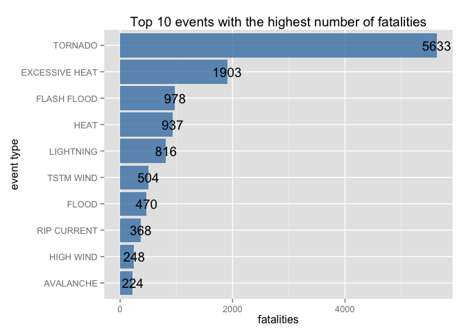
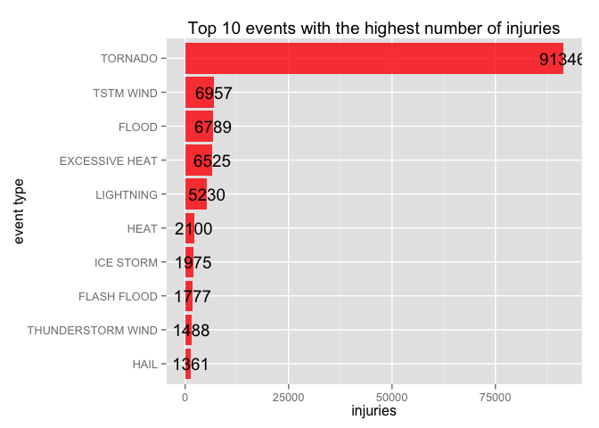
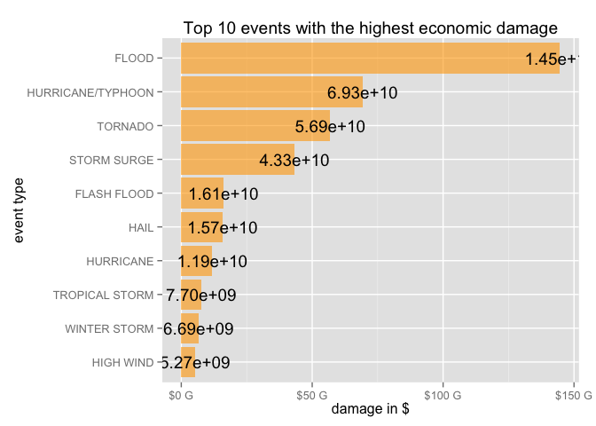

# Analysis of Severe Weather Events
Carlos Espino García  
April 24, 2015  

## Synopsis
The purpose of this report is to answer some questions about sever weather events in the US using the NOAA Storm Database from the National Weather Service. 

First, we analize which types of events (as indicated in the EVTYPE variable) are most harmful with respect to population health. To make this analisys, we compute the total fatalities and injuries by event and we get the top tens by number of fatalities and injuries to see which events are the most harmful. 

In second instance, we analize which types of events have the greatest economic consequences and we compute the total damage in money by event and get the top ten of events.

The events that caused more fatalities are tornados, excessive heat and flash flood. The events that caused more injuries are tornados, tstm wind and flood. Finally, the events that caused more economic losses are floods, hurricanes/typhoons and tornados.

## Data processing
Installing necessary packages

```r
library(dplyr)
library(ggplot2)
library(stringr)
library(scales)
library(knitr)
library(sitools)
```

Download thecompressed file and read it with ```read.csv```.


```r
## Setting working directory
setwd("~/Documents/git/datasciencecoursera/Reproducible Research/Project 2")

## Download file
if(!file.exists("data.csv.bz2")){
  download.file("https://d396qusza40orc.cloudfront.net/repdata%2Fdata%2FStormData.csv.bz2", "data.csv.bz2", method = "curl")
}

## Read data
data = read.csv("data.csv.bz2") %>% tbl_df()
```

To calculate the fatalities and injuries by event type we perform the next operations using the package ```dplyr``` functions.


```r
## Calculate total fatalities by event type
fatalities_by_evtype = data %>% group_by(EVTYPE) %>% 
  summarise(total_fatalities = sum(FATALITIES))  %>% 
  arrange(desc(total_fatalities)) %>% 
  slice(1:10)

## Calculate total injuries by event type
injuries_by_evtype = data %>% group_by(EVTYPE) %>% 
  summarise(total_injuries = sum(INJURIES))  %>% 
  arrange(desc(total_injuries)) %>% 
  slice(1:10)
```

For the purposes of this report PROPDMGEXP has been treated in the following way: 

+ If PROPDMGEXP value is **h**, **H**, **k** or **K** the multiplier is 1,000.
+ If PROPDMGEXP value is **m** or **M** the multiplier is 1,000,000.
+ If PROPDMGEXP value is **b** or **B** the multiplier is 1,000,000,000.
+ If PROPDMGEXP has any other value the multiplier is 1.

The following function follows uses the PROPDMGEXP value to compute the multiplier according to the rules given.


```r
exp_multiplier = function(exp) {
  exp = tolower(str_trim(exp, side = "both"))
  if (exp %in% c("h","k")) 1000
  else if(exp == "m") 1000000
  else if(exp == "b") 1000000000
  else 1
}
```

We compute the top events by economic losses.


```r
## Calculate damage by event type
dmg_by_evtype = data %>% mutate(mult = sapply(PROPDMGEXP,exp_multiplier), damage = PROPDMG*mult) %>% 
  group_by(EVTYPE) %>% 
  summarise(damage = sum(damage))  %>% 
  arrange(desc(damage)) %>% 
  slice(1:10)
```


## Results
1. Which types of events are most harmful with respect to population health?

We plot the top events by number of fatalities in a bar chart.


```r
## Plot total fatalities by event type
ggplot(fatalities_by_evtype) + 
  aes(x=reorder(EVTYPE, total_fatalities), y = total_fatalities) + 
  geom_bar(stat = "identity", fill = "steelblue",alpha = .8) + 
  geom_text(aes(label=total_fatalities)) +
  xlab("event type") + ylab("fatalities") + ggtitle("Top 10 events with the highest number of fatalities") +
  coord_flip()
```

 

We can see in the first chart that the events that cause more fatalities are tornados with 5,633 fatalities; excessive heat, with 1,903 and flash flood, with 978.

We plot the top events by number of injuries in a bar chart.


```r
## Plot total injuries by event type
ggplot(injuries_by_evtype) + 
  aes(x=reorder(EVTYPE, total_injuries), y = total_injuries) +
  geom_bar(stat = "identity", fill = "red",alpha = .8) + 
  geom_text(aes(label=total_injuries))+
  xlab("event type") + ylab("injuries") + ggtitle("Top 10 events with the highest number of injuries") +
  coord_flip()
```

 

The events that caused more injuries are tornados with 91,346 fatalities; tstm wind, with 6,957 and flood, with 6,789.

2. Which types of events have the greatest economic consequences?

We compute the total damage in money by event and get the top ten of events by economic losses.


```r
## Plot damage by event type
ggplot(dmg_by_evtype) + 
  aes(x=reorder(EVTYPE, damage), y = damage) + 
  geom_bar(stat = "identity", fill="orange", alpha = .6) + 
  geom_text(aes(label= scientific(damage))) + 
  xlab("event type") + ylab("damage in $") + ggtitle("Top 10 events with the highest economic damage") +
  coord_flip() +
  scale_y_continuous(labels = function(x) paste("$",f2si(x),sep=""))
```

 

The events that caused more economic losses are floods, hurricanes/typhoons and tornados.
